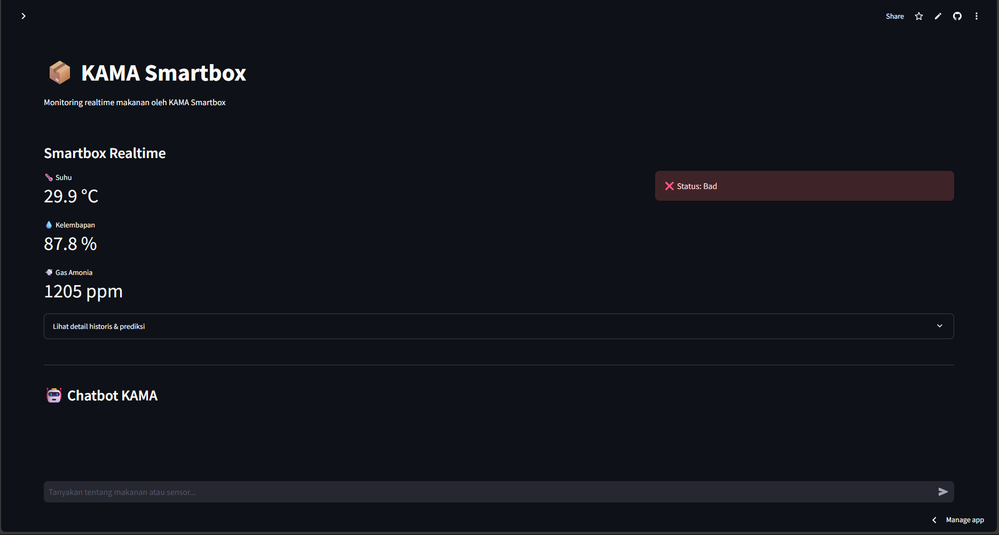

# KAMA SMART FOOD BOX

## KAMA : Smart Food Box yang Terintegrasi dengan Teknologi Artificial Intelligence (AI) dan Internet of Things (IoT) untuk Mengurangi Limbah Makanan Secara Berkelanjutan Menuju Zero Waste

KAMA : Smart Food Box adalah kotak penyimpanan makanan cerdas yang dilengkapi dengan sistem analisis dan preservasi makanan berbasis IoT dan AI. Perangkat ini memanfaatkan berbagai sensor, seperti sensor suhu, kelembapan, serta sensor gas (CO₂, metana, etilen, dan sejenisnya) untuk mendeteksi kondisi makanan secara real-time. Data dari sensor dianalisis menggunakan model klasifikasi berbasis AI untuk menentukan tingkat kesegaran makanan, memprediksi umur simpan, dan memberikan rekomendasi kepada pengguna terkait konsumsi maupun pengolahan makanan.

## Perangkat dan Penggunaannya

KAMA Smart Food Box didesain agar bisa digunakan seperti kotak makan pada umumnya, seperti bisa dimasukan ke tas, dibawa ke kantor dan dibawa kegiatan. KAMA Smart Food Box ini terdiri dari 2 komponon yaitu Perangkat Box dan Dashboard Interaktif.
<!--  -->

[Video lengkap](https://youtu.be/CR9zd9emEfs)

#### KAMA BOX Component

1. Rotten Food Analyzer → analisis kondisi makanan menggunakan sensor gas, suhu, kelembapan, dan klasifikasi AI.
2. Portable → KAMA Box didesain ringkas sehingga praktis untuk dibawa ke mana saja, layaknya sebuah lunch box. Sensor pendeteksi kelayakan makanan di dalamnya akan tetap aktif dan terus mengirimkan notifikasi ke smartphone selama daya baterai masih tersedia. Dengan begitu, tidak perlu khawatir tentang kualitas makanan Anda saat bepergian.

#### Dashbord KAMA

Kama Dashboard merupakan webapp dashboard pendamping KAMA yang berperan sebagai pusat kontrol dan notifikasi pengguna. Tersedia beberapa fitur utama berbasis teknologi AI dan LLM:

1. Real-Time Box Monitoring → Menampilkan status terkini dari masing-masing Box yang sedang aktif.
2. Chatbot: AI-based Recommendation System → prediksi umur makanan, rekomendasi pengolahan untuk mencegah food waste, serta integrasi chatbot berbasis LLM sebagai asisten pengguna.

## Arsitektur IoT

Arsitektur IoT pada KAMA Smartbox terdiri dari beberapa komponen utama yang saling terintegrasi untuk memastikan monitoring dan analisis makanan secara real-time:

1. **Sensor Box (Perangkat IoT)**
   - Dilengkapi dengan sensor suhu, kelembapan, dan gas (CO₂, metana, etilen, dll) yang terhubung ke mikrokontroler (misal ESP32).
   - Sensor membaca kondisi lingkungan makanan secara berkala dan mengirimkan data ke server melalui koneksi Wi-Fi.

2. **IoT Gateway & Server**
   - Data sensor dikirimkan ke backend server (Flask API) menggunakan protokol HTTP (REST API).
   - Server menerima data, menyimpannya ke database (PostgreSQL), dan menjalankan proses ETL serta analisis AI untuk klasifikasi status makanan dan prediksi umur simpan.

3. **Dashboard & Notifikasi**
   - Dashboard interaktif (Streamlit) mengambil data dari database untuk menampilkan status makanan, prediksi, dan rekomendasi kepada pengguna.
   - Notifikasi dan rekomendasi dapat diakses secara real-time melalui dashboard atau chatbot AI.

4. **Aktuator (Opsional)**
   - Berdasarkan status makanan, perangkat dapat mengaktifkan aktuator seperti LED indikator (merah/kuning/hijau) untuk memberi peringatan langsung pada pengguna.

**Alur Data:**
- Sensor → Mikrokontroler → Server (API) → Database → Dashboard/Notifikasi → Pengguna

## AI Framework

